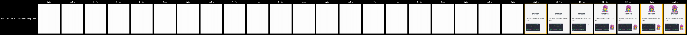
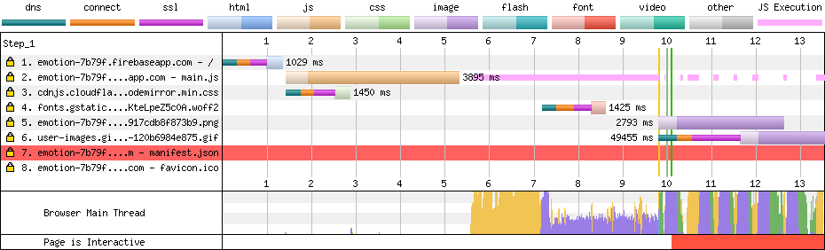
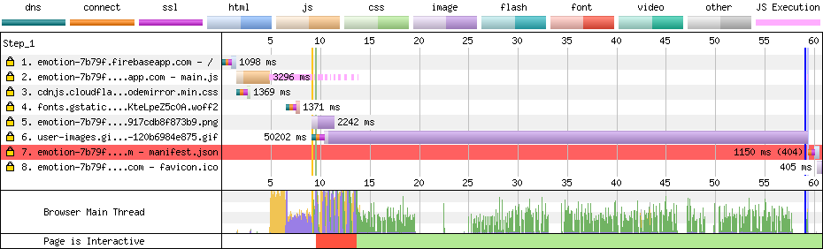
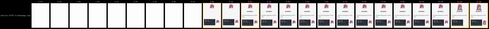
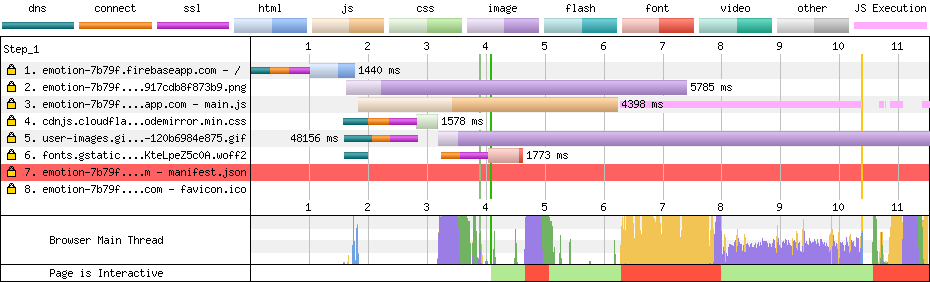
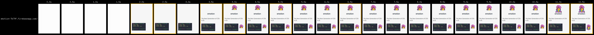
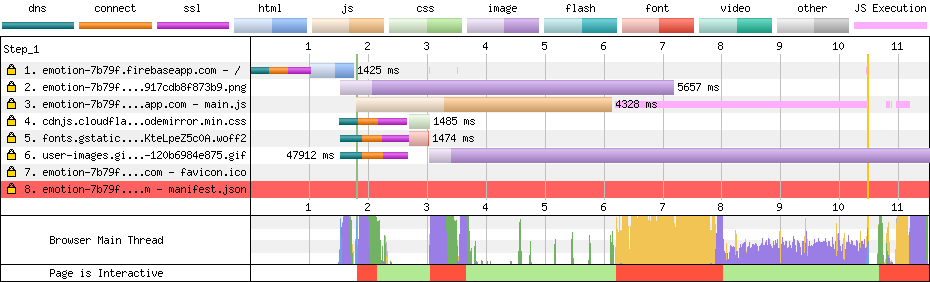
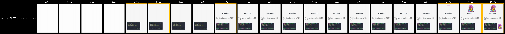
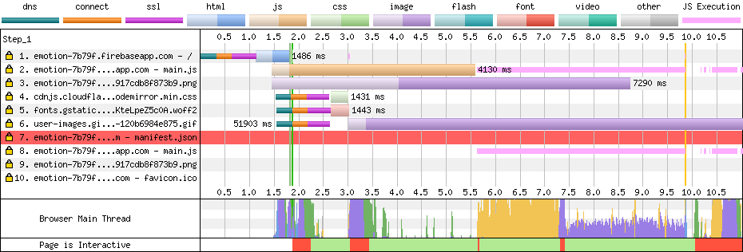

Experiment: how much faster you can make [emotion website](https://emotion.sh/).

Let's set expectations upfront. I do not suggest to switch to one technology over another. I use real-life measurement metrics and minimal example. The purpose is to show that you can get a lot of performance improvement, with a small investment of your time, it is not hard at all. You do not need Ph.D. to do this.

Setup:
- All measurements were done using [webpagetest](https://www.webpagetest.org) with following settings: "From: Dulles, VA - Moto G4 - Chrome - 3G".
- Most measurements were done against **firebase**, but still, there is variation in Time To the First Byte from 1.3s to 1.7s. This is because of network fluctuations, it is out of experiment scope. Apply correlation accordingly.
- Code for experiments are stored in [stereobooster/emotion#react-snap](https://github.com/stereobooster/emotion/tree/react-snap)
- Each step is stored in the separate tag. To test it, do the following:

```sh
git clone https://github.com/stereobooster/emotion.git
cd emotion
git checkout round-N
yarn install
yarn build:site
```

## Round 0

```
git checkout round-0
```



| Load Time | First Byte | Start Render | Speed Index | First Interactive (beta) | Time    | Requests | Bytes In | Time    | Requests | Bytes In | Cost  |
|-----------|------------|--------------|-------------|--------------------------|---------|----------|----------|---------|----------|----------|-------|
| 59.639s   | 1.350s     | 9.525s       | 9676        | 14.866s                  | 59.639s | 6        | 9,084 KB | 61.694s | 8        | 9,113 KB | $$$$$ |





## Round 1

```
git checkout round-1
```

Add `react-snap`. No configurations!



| Load Time | First Byte | Start Render | Speed Index | First Interactive (beta) | Time    | Requests | Bytes In | Time    | Requests | Bytes In | Cost  |
|-----------|------------|--------------|-------------|--------------------------|---------|----------|----------|---------|----------|----------|-------|
| 49.870s   | 1.473s     | 4.072s       | 4384        | 15.375s                  | 49.870s | 6        | 9,144 KB | 51.388s | 8        | 9,174 KB | $$$$$ |



## Round 2

```
git checkout round-2
```

Use `"inlineCss": true`.



| Load Time | First Byte | Start Render | Speed Index | First Interactive (beta) | Time    | Requests | Bytes In | Time    | Requests | Bytes In | Cost  |
|-----------|------------|--------------|-------------|--------------------------|---------|----------|----------|---------|----------|----------|-------|
| 53.369s   | 1.331s     | 1.777s       | **2208**    | 14.237s                  | 53.369s | 6        | 9,210 KB | 54.875s | 8        | 9,242 KB | $$$$$ |



## Round 3


```
git checkout round-3
```

Use `Link` headers.



| Load Time | First Byte | Start Render | Speed Index | First Interactive (beta) | Time    | Requests | Bytes In | Time    | Requests | Bytes In | Cost  |
|-----------|------------|--------------|-------------|--------------------------|---------|----------|----------|---------|----------|----------|-------|
| 54.145s   | 1.472s     | 1.886s       | 2603        | **13.238s**              | 54.145s | 6        | 9,020 KB | 56.609s | 10       | 9,918 KB | $$$$$ |




## Next steps

- replace gif with mp4
- postpone download of gif until needed (play button)
- optimize font loading strategy
- optimize image and/or use a smaller size

